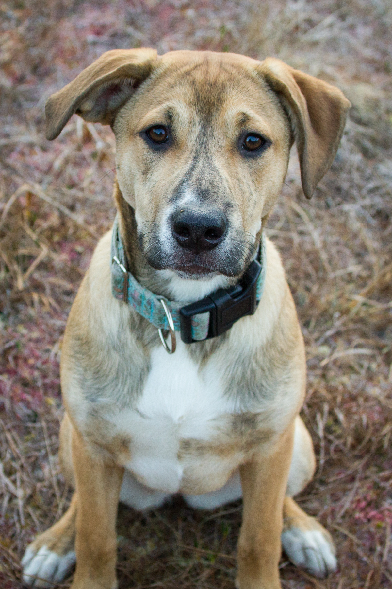

```{r setup, include=FALSE}
knitr::opts_chunk$set(echo = TRUE)
```

# Outline of manuscript work

- Data Cleaning
- [Analysis](analysis.html)
- Mapping
- Discussion


<!--  -->

```{r graphics, fig.align='center', out.width= "50%", echo=FALSE}


```

